# Features

## Navigation Bar

### Site Logo

-   Positioned in the center for mobile and left hand side for desktop.
-   Includes site name Wild Root with a leaf icon.
-   Acts as a link to the home page.

### Collapsible Hamburger Menu

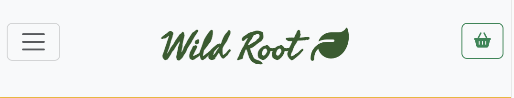
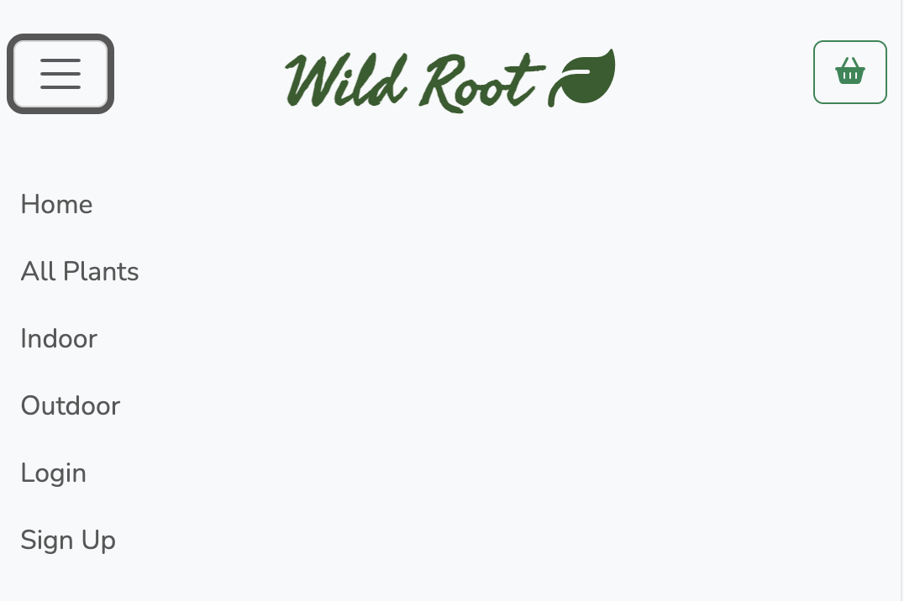

-   Shown on smaller screens.
-   Toggles the main navigation links.

### Shopping Bag

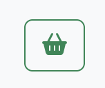

-   Basket Icon Button
-   Positioned in the top-right corner.
-   Visible at all screen sizes (not hidden behind collapsible menu).
-   Links directly to the shopping bag page.

### Navigation Links

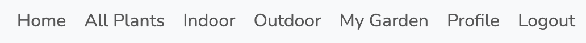
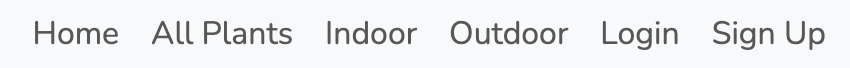

-   Links for All Users:

    -   Home
    -   All Plants
    -   Indoor
    -   Outdoor

-   Links for Logged-In Users:

    -   My Garden
    -   Profile
    -   Logout

-   Links for Anonymous Users:

    -   Login
    -   Sign Up

## Informative Banner

Banner informing the user that delivery is only within the UK
Yellow background to ensure it is clearly visible to the user
Only appears on pages directly linked to e-commerce functionality

## Footer

### Social Media Integration

-   Icons for major platforms:
    -   Instagram
    -   X (Twitter)
    -   Facebook
    -   Pinterest
-   Each icon:
    -   Uses a recognizable Font Awesome logo.
    -   Opens the link in a new tab (target="\_blank").
    -   Includes rel="noopener" for security.

### Copyright notice displayed at the bottom.

## Home Page

### Hero Section

Full-width hero image overlaid with centered text and call-to-action:

-   Headline: “Grow Wild. Stay Rooted.”
-   Subheading: “Curated indoor and outdoor plants for every home.”
-   CTA Button:
    -   Large green “Shop Now” button.
    -   Links to the full product list.

### Mission Statement

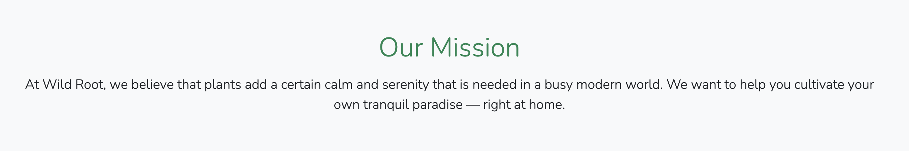

Paragraph explaining the brand’s ethos (calm, serenity, plant care in modern life).

### Why Choose Wild Root Section

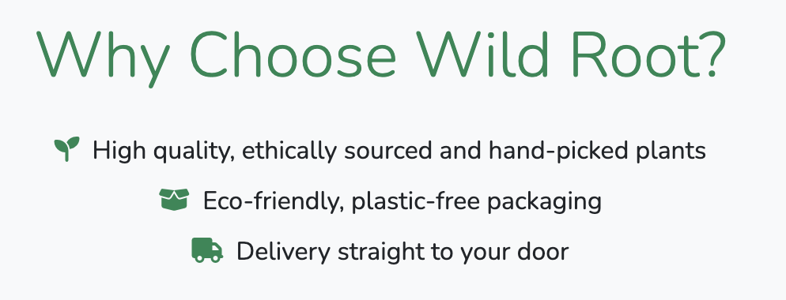

Highlighted benefits with icons and clear bullet points:

-   Ethically sourced plants
-   Eco-friendly, plastic-free packaging
-   Home delivery

### Browse Categories

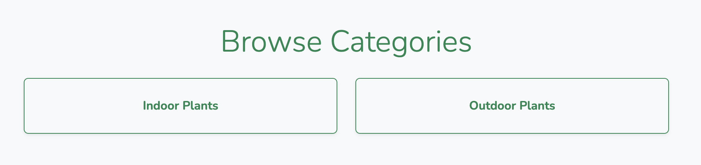

Interactive category buttons:

-   Indoor Plants
-   Outdoor Plants

Buttons link to products page with associated filters applied.

### My Garden Call to Action

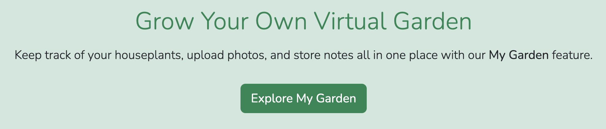

Dedicated CTA encouraging users to manage their plants:

-   Title: “Grow Your Own Virtual Garden”
-   Summary: Tracks houseplants, photos, and notes.
-   CTA Button: “Explore My Garden”

Button links to the "My Garden" page.

## Authenitication

### Signup Page

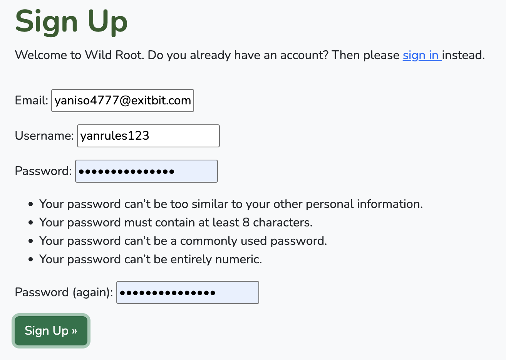

-   Form for account creation
-   Message linking to the login page encouring users to log in if they already have an account
-   Sends a account verification email and inks to Account Verification Page on form submit

#### Account Verification Page

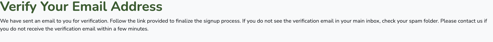

-   Informs the user that an account verification email has been sent and that they need to click the link in the email to verify their account.

#### Account Verification Email

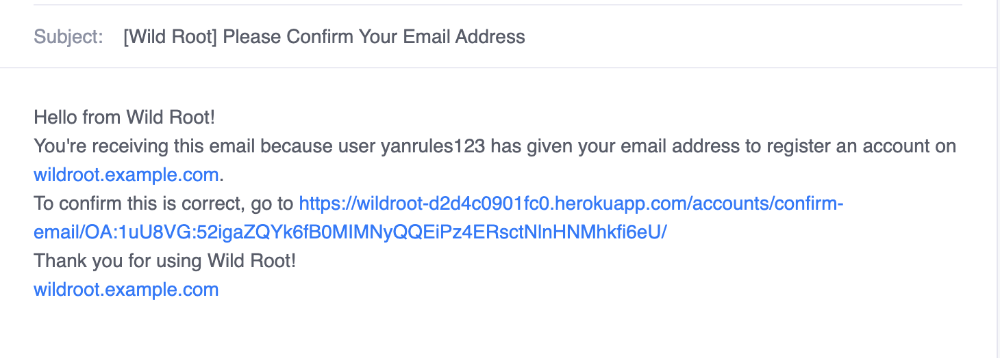

-   Sent to the user on sign up form submit
-   Confirmation link takes them to the account confirmation page

#### Account Confirmation Page

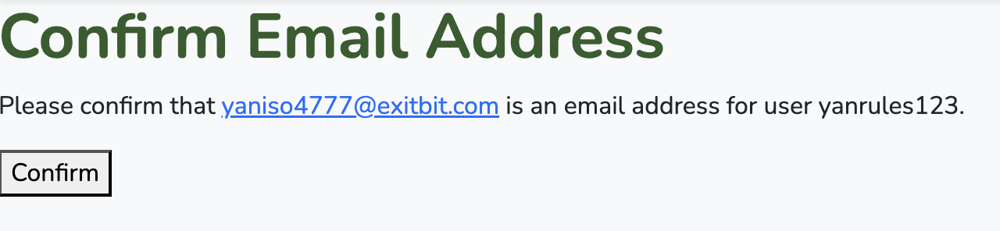

-   Confirmation button, confirms the users account and redirects them to the sign in page.

### Sign In Page

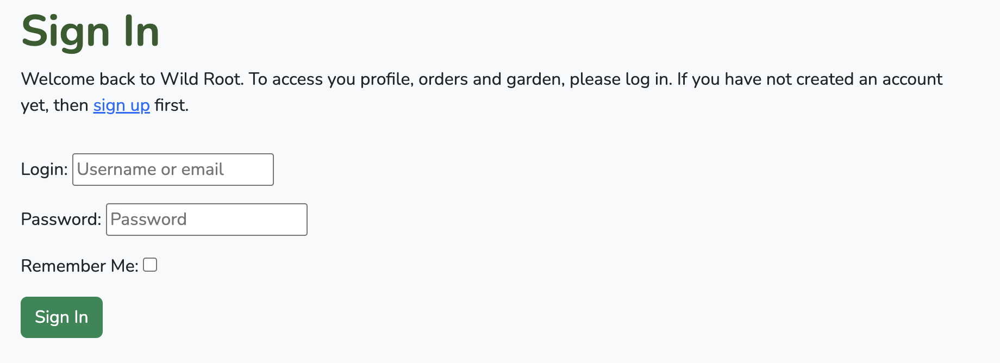

-   Form to log in
-   Message linking to the sign up page encouraging users to sign up if they don't already have an account

### Log Out Page

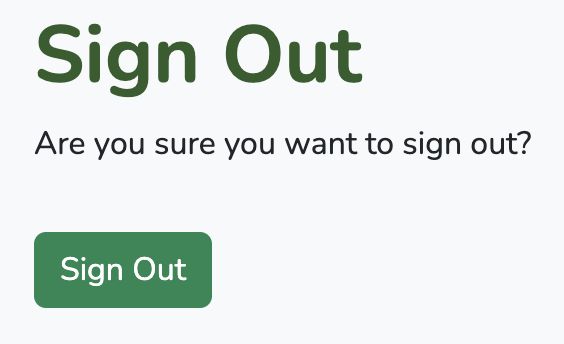

-   Log‑out page confirming the user wants to sign out with a simple form.

## Products Page

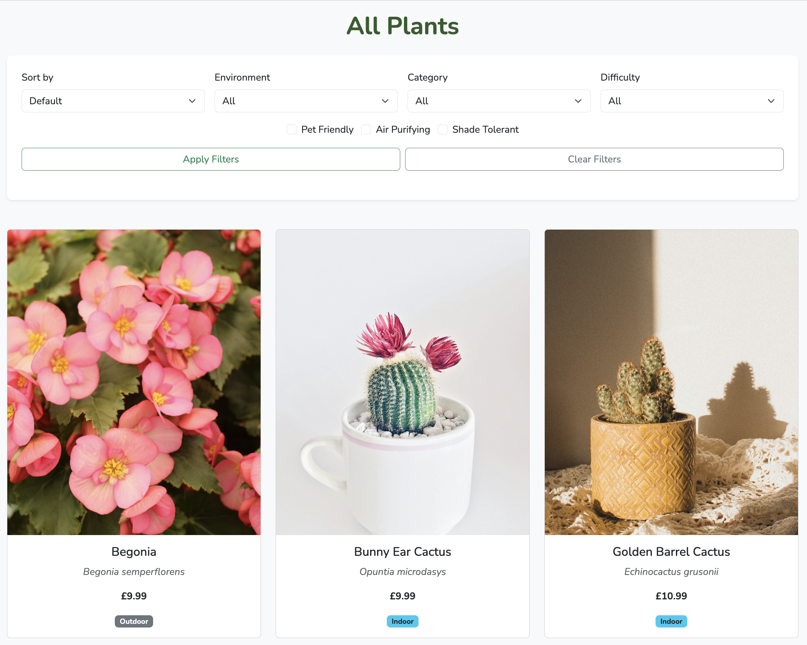

### Dynamic Page Title

The heading dynamically updates based on the environment filter:

Indoor Plants, Outdoor Plants, or All Plants.

### Filter and Sort Panel

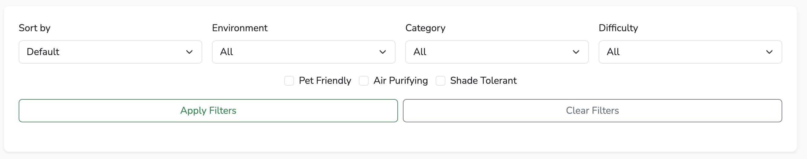

Fully responsive filter form, allowing users to narrow down visible products.

1. Sort Options
   Dropdown to sort by:

-   Default
-   Price (Low - High)
-   Price (High - Low)

2. Filter by Environment
   Dropdown to select from:

    - Indoor
    - Outdoor

    (auto-selected if already filtered).

3. Filter by Category
   Dropdown to select from:

    - Ferns
    - Succulents
    - Snake Plants
    - Cacti
    - Monstera
    - Trees
    - Evergreens
    - Climbers
    - Flowers

4. Filter by Difficulty
   Easy / Medium / Hard dropdown filter.

5. Tag Filters
   Horizontal checkboxes:

-   Pet Friendly
-   Air Purifying
-   Shade Tolerant

6. Filter Buttons

-   “Apply Filters” button (submit).
-   “Clear Filters” resets filters by linking to the base products URL.

### Product Grid

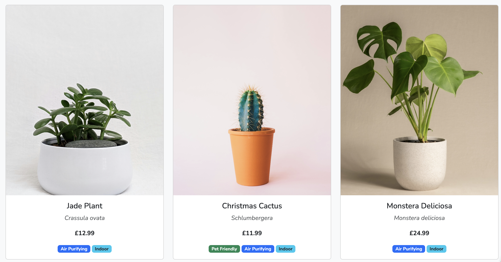

Displays all filtered products in a responsive grid layout.
Each product card includes:

-   Image: using provided image or if none provided placeholder.
-   Name
-   Botanical name
-   Price
-   Tag Badges: Pet Friendly (green), Air Purifying (blue), Indoor/Outdoor (info/secondary)

Stretched Link: entire card is clickable via invisible link.

Querystring preserved in detail link (filters persist after returning).

### No Results Handling

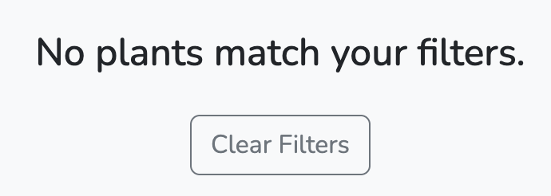

If no products match filters:

-   Friendly message: “No plants match your filters.”
-   Button to clear filters and return to full product list.

### Pagination

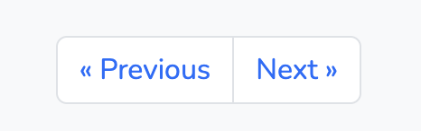

Bootstrap-styled pagination with:

-   Previous / Next buttons.
-   Querystring retained across pages.

### Go to Top Button

Floating Go to Top button:

-   Hidden by default, appears on scroll.
-   Smooth scroll to top when clicked.
-   Green circular button with fa-arrow-up icon.

## Product Detail Page

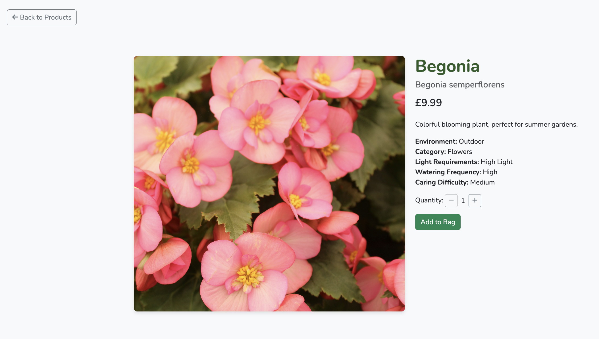

### Back to Products Button

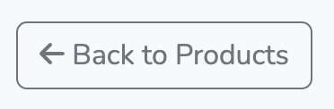

Clearly labeled “Back to Products” button with left arrow icon.
Takes the user back to the products page.
Preserves previous filters and sort settings, great for seamless navigation back to the product list.

### Product Overview

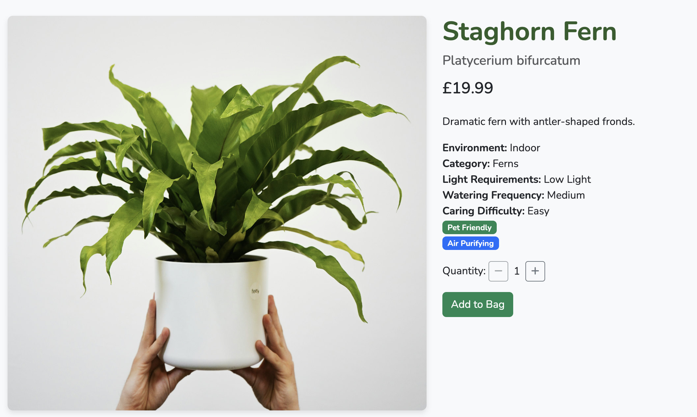

Product image (or placeholder) displayed on the left.

Details column on the right includes:

-   Product name and botanical name.
-   Price in bold with styling.
-   Rich text description of the plant.

### Care Information

Presented as a list with clear headings:

-   Environment (indoor/outdoor)
-   Category name
-   Light requirements
-   Watering frequency
-   Caring difficulty

Makes it easy for buyers to assess plant suitability.

### Feature Tags

Conditional badges (Bootstrap-styled):

-   Pet Friendly (bg-success)
-   Air Purifying (bg-primary)
-   Shade-tolerent

Visually emphasizes important attributes.

### Add to Bag Functionality

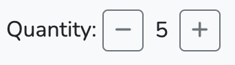
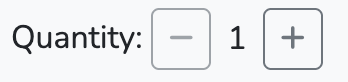

Inline quantity selector:

-   Plus/minus buttons with dynamic disabling

Submit button labeled "Add to Bag"

## Shopping Bag

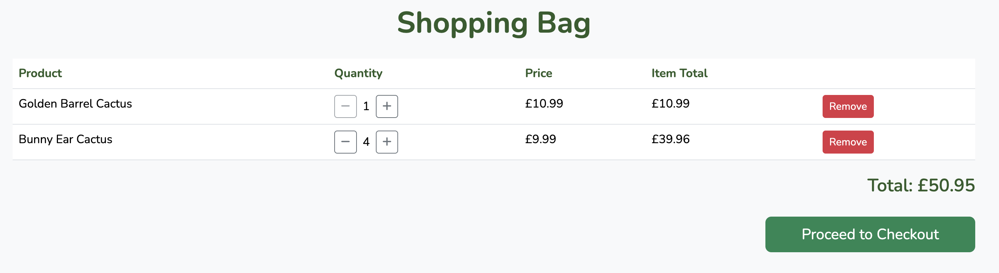

### Dynamic Bag Content

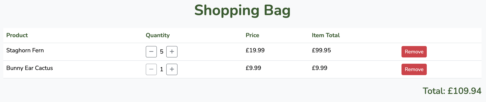
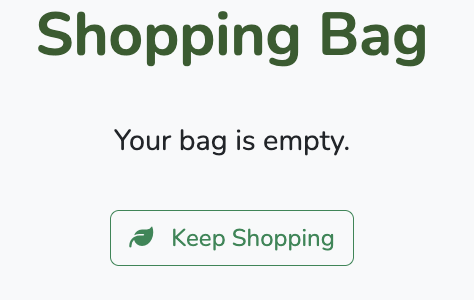
Conditional rendering:

-   Shows full table if bag contains items.
-   Shows "Your bag is empty" message if not.

### Bag Table (if items exist)

Responsive Bootstrap table showing:

-   Product name
-   Quantity controls
-   Individual product price
-   Calculated item total
-   Remove button

#### Quantity Controls

Each row in the quantity controls column includes:

-   Minus button (decreases qauntity, disabled if quantity is 1)
-   Quantity display (dynamic)
-   Plus button (increases quantity)

Buttons are interactive, triggering adjust_bag form submission.

#### Remove Button

"Remove" button for each item.

Removes item from bag and updates session storage.

### Total Summary

Displays total cost of all items at the bottom-right of the table.
Styled prominently for visibility.

### Proceed to Checkout Button

If user is authenticated:

-   Shows green button linking to the checkout page.

If not logged in:

-   Shows disabled button.
-   Displays message with links to log in or sign up.

### Empty Bag Message

If no items are in the bag:

-   Displays message: "Your bag is empty."
-   Includes a “Keep Shopping” button which links to product list page.

## Checkout

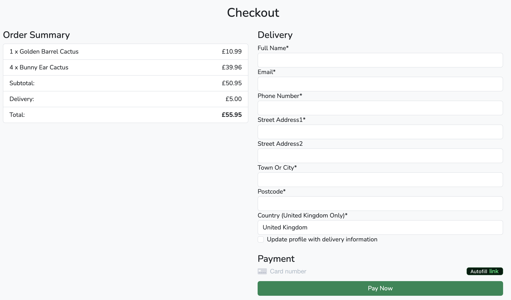

Only accessible to an authenticated user

### Order Summary

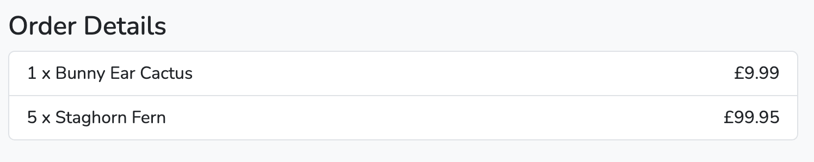

Breakdown of the shopping bag contents
Each item shows:

-   Quantity
-   Plant name
-   Total cost per line item
-   Subtotal, Delivery, and Grand Total rows

### Delivery & Payment Form

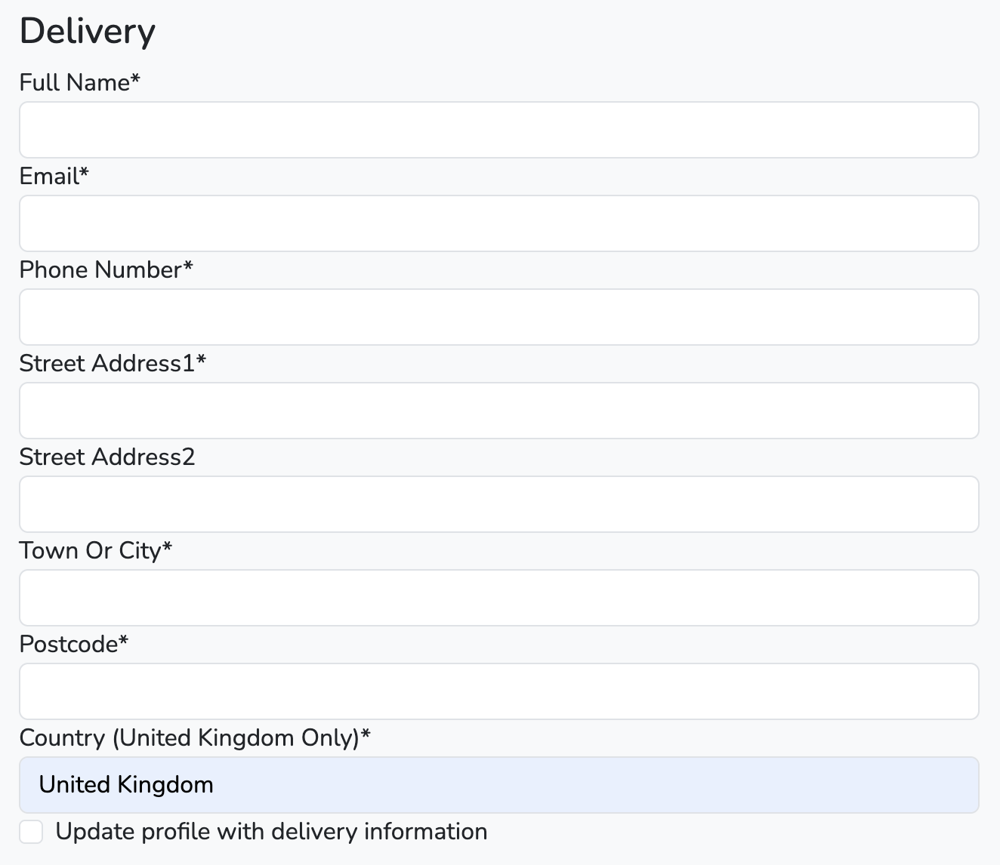

#### Django Crispy Form for delivery fields:

(pre-populated if user has information saved to their profile)

-   Full Name
-   Email
-   Phone Number
-   Address fields
-   Country field restricted to UK only

If form errors exist:
Shows a Bootstrap alert box listing errors per field

"Save Info" Checkbox - Option to save delivery information to user profile

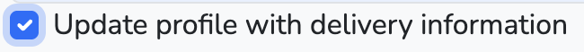

#### Stripe Payment Section

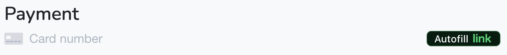

Renders Stripe's card-element input
Real-time validation on card input
Errors displayed for invalid information

### Submit Button

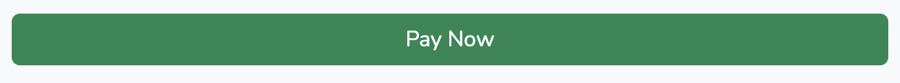

"Pay Now" button, to submit the checkout form
Disabled while processing to prevent duplicate submissions

### Loading Overlay

Displays a page overlay with “Processing payment…” message
Appears when payment is being submitted
Hides main form to avoid interaction while waiting for confirmation

## Checkout Success/Order Details

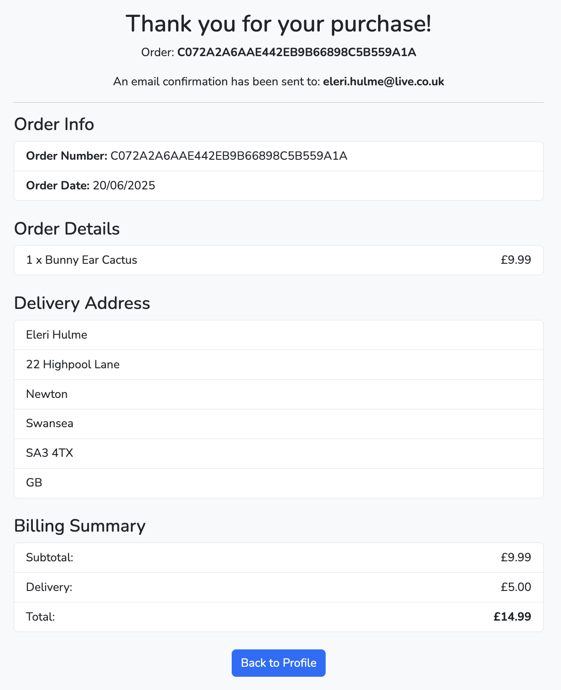

Same template is used for both checkout success page (when the user has successfully made an order) and order details (when the user is view a past order from their profile)

### Dynamic title:

-   If viewed via order history: "Order Details"
-   If accessed after checkout: "Checkout Success"

### Success Confirmation Section

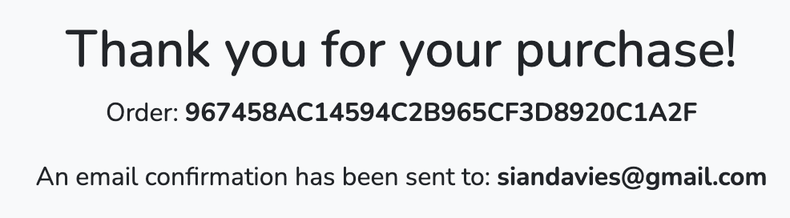

Displays:

-   Order number
-   Confirmation email address (order.email)

Helps reassure user that payment was processed and confirmation sent

### Order Info Section

[Order Info Section](documentation/features/order_info.png)

Clearly lists:

-   Order number
-   Order date (formatted DD/MM/YYYY)

### Order Details Section

Lists each item purchased with details of:

-   Quantity (item.quantity)
-   Product name (item.plant.name)
-   Line total (item.item_total)

### Delivery Address Section

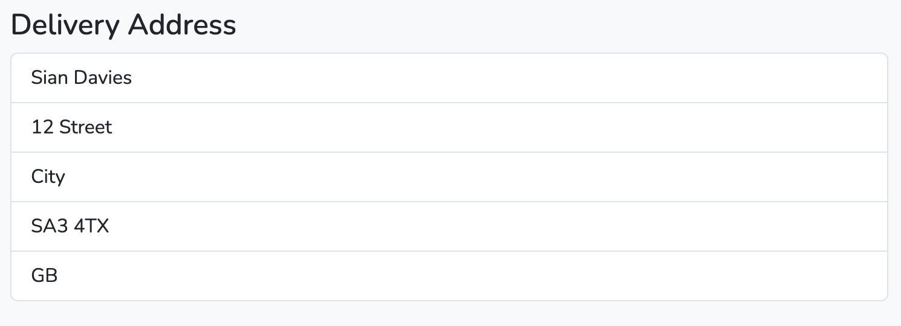

Displays shipping information:

-   Full name
-   Street address 1 (and 2 if available)
-   Town/city
-   Postcode
-   Country

Useful for the user to confirm delivery destination

### Billing Summary

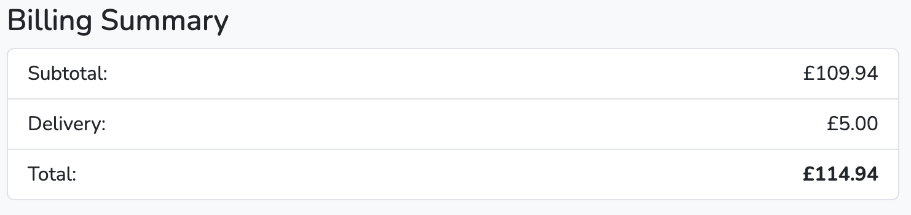

Clear breakdown of:

-   Subtotal
-   Delivery cost
-   Total paid

### Navigation Options

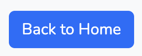
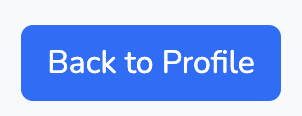

Dynamic button depending on user flow:

-   From checkout: “Back to Home”
-   From profile: “Back to Profile”

## Profile

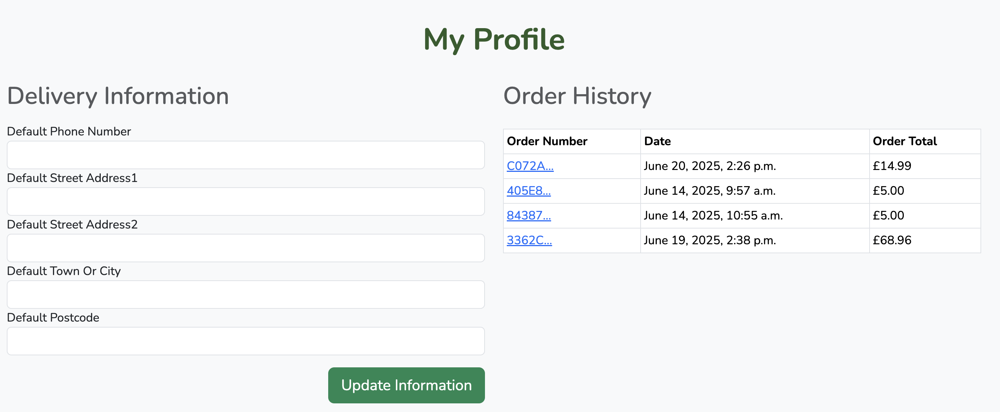

Only accessible to an authenticated user

### Delivery Information

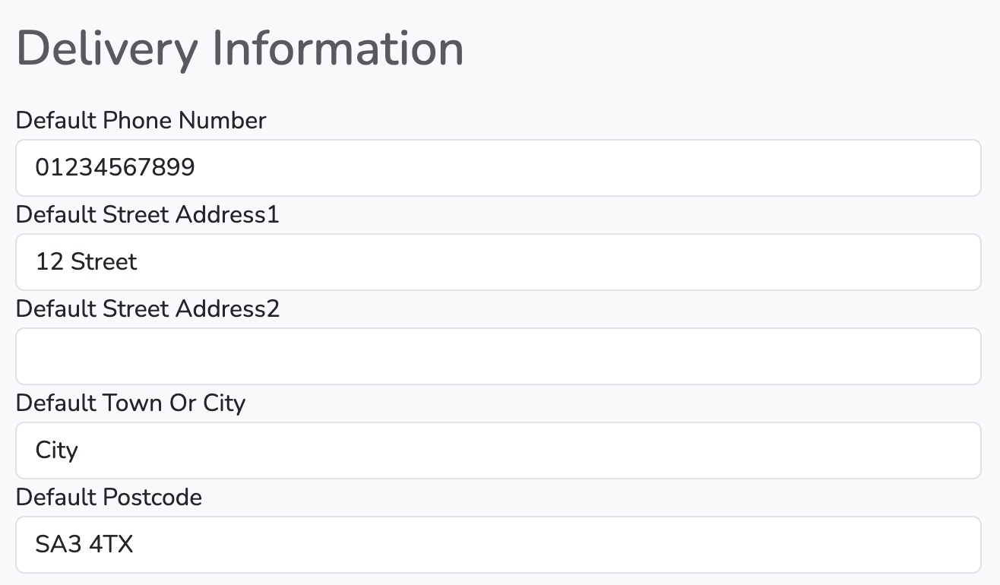

Displays a form prefilled with the user’s saved shipping details

Fields include:

-   Phone number
-   Address fields

"Update button" submits the updated delivery info

### Order History

#### If the user has orders:

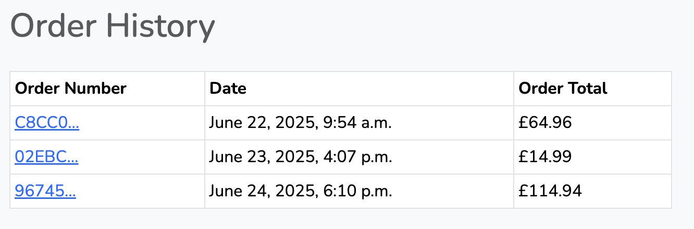

Displays a responsive table of previous orders

Table includes:

-   Order Number
-   Order Date
-   Order Total

Each order number is:

-   Truncated to 6 characters
-   Hyperlinked to the order history view with full order info

#### If no orders exist:

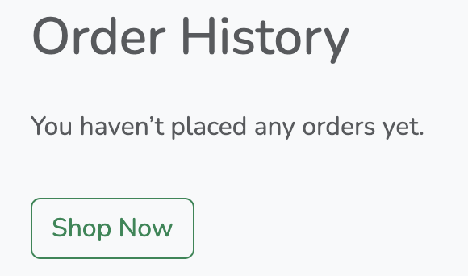

Message displayed: "You haven’t placed any orders yet."
CTA button: "Shop Now" (links to products page)

## Garden

### If User Is Not Authenticated

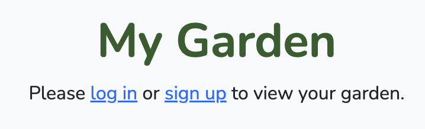

Displays a message:

“Please log in or sign up to view your garden.”

Includes accessible links to:

-   Login page
-   Signup page

### If User Is Authenticated

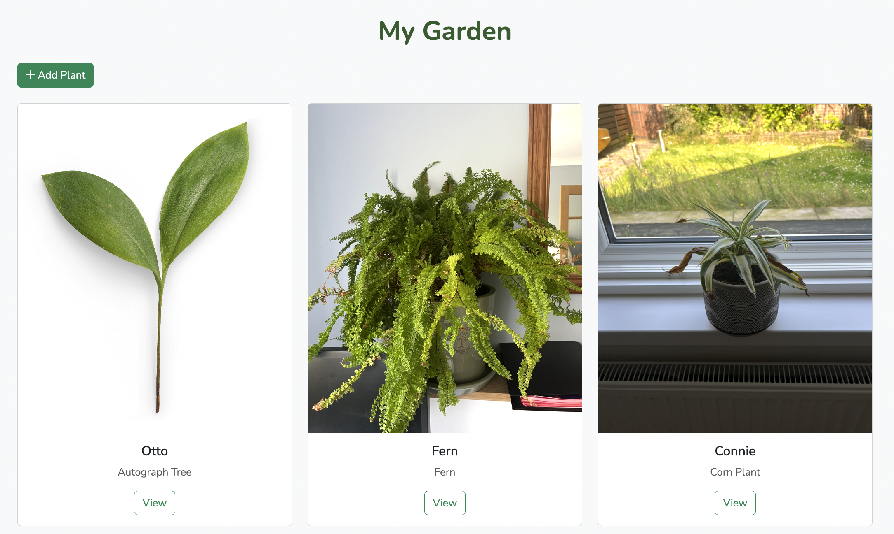

Add Plant Button:

-   Navigates to add plant page

#### If the user has added plants:

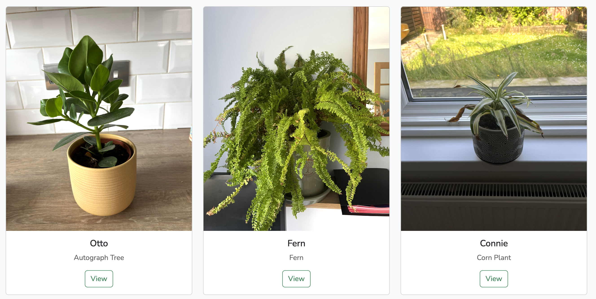

Grid layout showing cards for each of the plants the user has added

Card Features:

-   Clickable image linking to the plant's detail page (plant_detail)
-   Uses method get_latest_image_url for the most recent photo or placeholder
-   Plant nickname as card title
-   Species name shown as muted text
-   "View" button for navigation to the plant’s details

#### If No Plants Yet

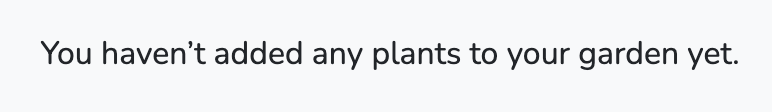

Shows message:
“You haven’t added any plants to your garden yet.”

## Garden Plant Detail

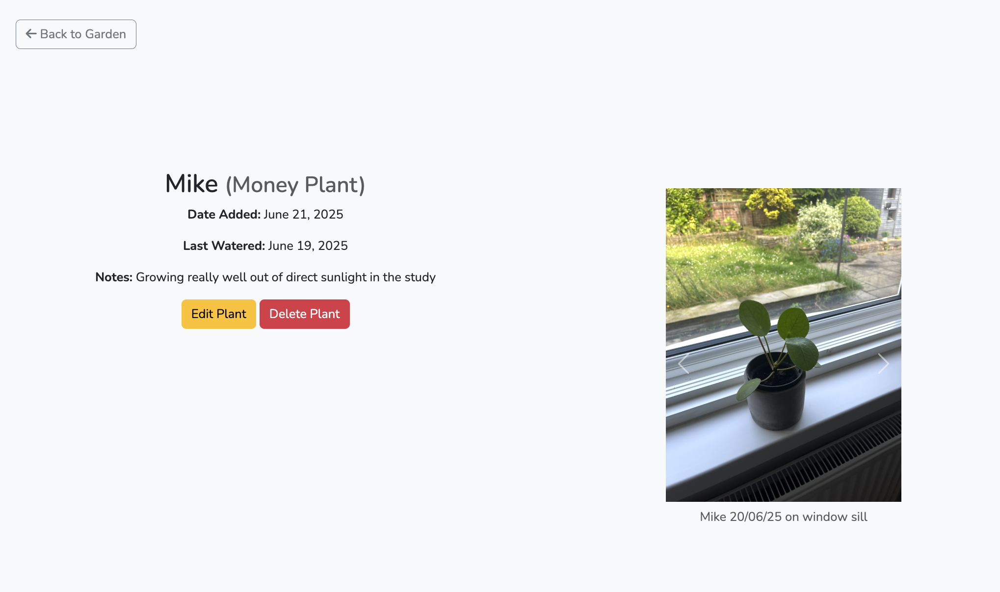

### Back to Garden button

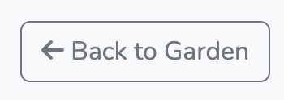

Returns user to the main My Garden page

### Plant Information Section


Information displayed:

-   Plant Nickname and Species
-   Date Added
-   Last Watered (displayed if present)
-   User Notes (displayed only if the plant has notes saved)

Actions:

-   Edit Plant Button
    Links to the edit plant page

-   Delete Plant Button
    Opens a Bootstrap modal for confirmation

### Delete Confirmation Modal


Modal dialog to confirm deletion of a plant
Contains:

-   Cancel button: to close the modal
-   Confirm button: to submit delete request

### Photo Carousel

Conditional logic:

-   If multiple photos: Bootstrap Carousel with next/prev buttons


-   If one photo: Carousel without controls


-   If no photos: Message “No photos yet.”


Carousel Features:

-   Dynamically loops over all uploaded photos
-   Each photo includes:
    -   Image with alt text
    -   Optional caption under the image

## Add/Edit Garden Plant


### Dynamic page title based on context:

Displays as "Add Plant" if creating a new plant.
Displays as "Edit [Plant Nickname]" if updating an existing plant.

### Plant Details Form


Uses Django’s crispy_forms for layout and validation.
Form is prefilled if editing an existing plant.


Collects:

-   Plant species
-   Nickname
-   Last watered date (with date/time picker)
-   Notes

### Add Photo Form


Allows uploading one photo per submission.
Caption and image description (alt text) required if a photo is uploaded.
User guidance text: "Only one photo can be uploaded at a time, but one additional photo can be added each time you edit your plant."

### Form Actions

#### Submit Button

One button used for both forms

Dynamically labelled:

-   "Add Plant" for new entries.
-   "Update Plant" for editing.

#### Cancel Button

Redirects back to the My Garden page.

### Photo Management (Edit Mode Only)


Displays all existing photos for the plant in a responsive grid.

Each photo includes:

-   Thumbnail image.
-   Caption.
-   Image alt text.
-   Delete Photo Button: allows user to delete individual photos.

## Admin


Standard Django admin site, only accessible to the superuser.
Used by the superuser for managing:

-   products
-   product categories
-   orders
-   profiles

## 404 Page


### Messaging

Headline: 404 - Lost in the Jungle
Playful, on-brand error message tied to the plant/jungle theme.

Subtext Paragraph:
Friendly guidance: "Oops! Looks like you took a wrong turn and got lost in the greenery."

### Navigation Recovery

Call-to-Action "Go Back Home" Button: redirects to the Home page.

## Responsive Features

The site uses Bootstrap’s responsive grid system and utility classes to ensure all content adjusts smoothly across devices.

-   Navigation bar collapses into a hamburger menu on smaller screens using Bootstrap's navbar classes.
-   Product listing cards and garden plant cards dynamically resize using responsive column classes.

## UX Features

-   Hover effect is applied on all clickable elements, to show user which parts of the site they can interact with.

-   Messages displayed when user perfroms actions on the site.


-   Invalid form messaging, so show user why form submission failed.


-   Use of font awesome icons to enhance clarity

### Accessiblity Features

-   All interactive elements have aria-lables for screen readers.
-   Use of semantic HTML.
-   Alt-text for all images.

### Security Features

-   All forms use CSRF tokens
