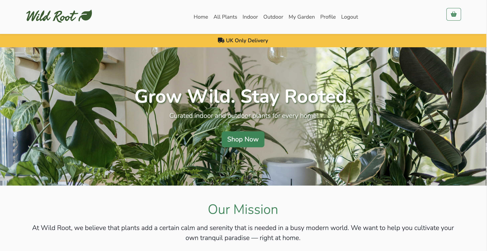
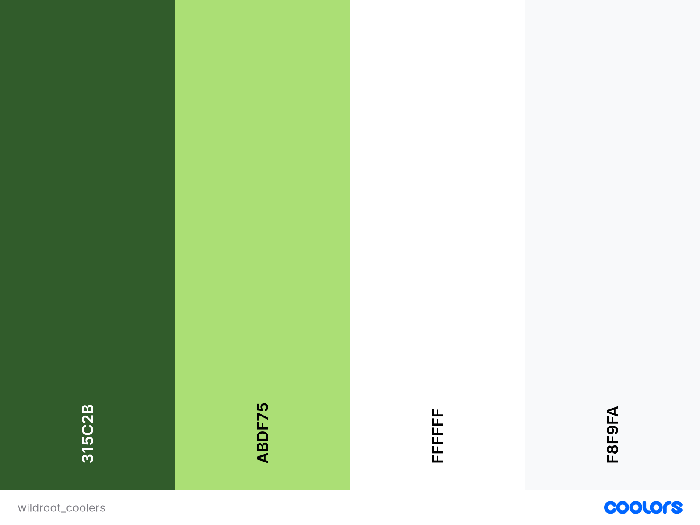
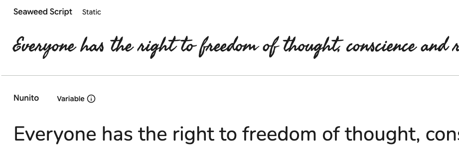
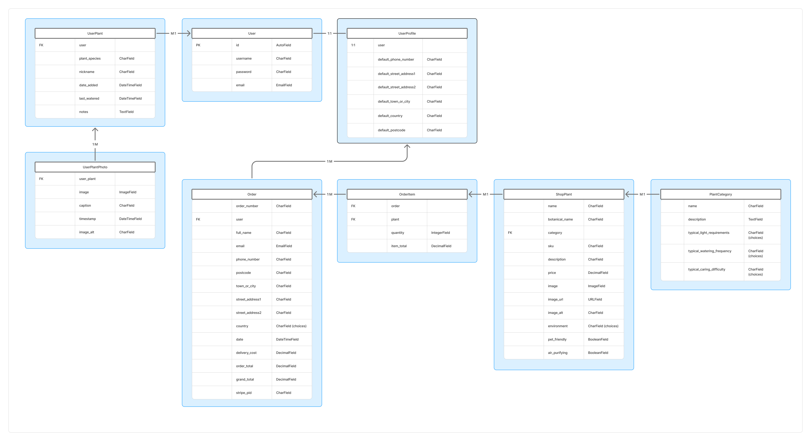

# Wild Root E-Commerce

**Deployed website: [Link to website](https://wildroot-d2d4c0901fc0.herokuapp.com/)**



**Card number for payment testing: 4242424242424242**

## About

Wild Root is an e-commerce platform for buying indoor and outdoor plants. It aims to make plant shopping straightforward and enjoyable, whether you are a beginner or a seasoned gardener. It also provides the oppurtunitity for users to track and upload images of their own plants.

---

## UX

### Target Audience

-   Homeowners and apartment dwellers who want to decorate with plants.

-   Hobby gardeners looking for new species and reliable care information.

-   Busy individuals seeking convenient online plant shopping with delivery options.

### User Stories

#### General User

| Issue ID                                                | User Story                                                                                                                                                                 |
| ------------------------------------------------------- | -------------------------------------------------------------------------------------------------------------------------------------------------------------------------- |
| [#5](https://github.com/elerihulme/wildroot/issues/5)   | As a user I can see the custom 404 page when a URL isn't recognised so that I still feel like I'm on the site and can navigate easily back to recognised page              |
| [#6](https://github.com/elerihulme/wildroot/issues/6)   | As a user I can see the custom favicon in the browser tab so that I can easily find the page when I have several tabs open                                                 |
| [#8](https://github.com/elerihulme/wildroot/issues/8)   | As a user I can access the social media pages of the company so that I can say up to date on the latest news and updates                                                   |
| [#9](https://github.com/elerihulme/wildroot/issues/9)   | As a user I can easily navigate through the app so that I can find what I'm looking for quickly                                                                            |
| [#10](https://github.com/elerihulme/wildroot/issues/10) | As a user I can easily understand the main purpose of the app so that I can how it is useful for me                                                                        |
| [#15](https://github.com/elerihulme/wildroot/issues/15) | As a user I can see the total of all my items in the bag so that I know how much I'm spending overall                                                                      |
| [#16](https://github.com/elerihulme/wildroot/issues/16) | As a user I can receive messages when I add or remove an item from my bag so that I know if the action has been successful                                                 |
| [#17](https://github.com/elerihulme/wildroot/issues/17) | As a user I can remove an item from my bag so that I can change my mind about a product                                                                                    |
| [#18](https://github.com/elerihulme/wildroot/issues/18) | As a user I can increase or decrease the number of a product in my bag so that I can easily buy the quantity that I want                                                   |
| [#19](https://github.com/elerihulme/wildroot/issues/19) | As a user I can view the contents of my bag at anytime so that I can review my current selection of products                                                               |
| [#20](https://github.com/elerihulme/wildroot/issues/20) | As a user I can view product tags so that I can easily see key information about a product                                                                                 |
| [#21](https://github.com/elerihulme/wildroot/issues/21) | As a user I can navigate through multiple pages of products so that I can easily view products in manageable numbers                                                       |
| [#22](https://github.com/elerihulme/wildroot/issues/22) | As a user I can view a list of products so that I can see the products available to purchase                                                                               |
| [#23](https://github.com/elerihulme/wildroot/issues/23) | As a user I can see the nav bar links change depending on my authentication status so that I can know my authentication status and can the relevant links accessible to me |
| [#24](https://github.com/elerihulme/wildroot/issues/24) | As a user I can receive messaging from the site when registering so that I can fix any errors when registering and know when I've successfully registered                  |
| [#25](https://github.com/elerihulme/wildroot/issues/25) | As a user I can register for an account so that benefit from all the features available to registered users                                                                |
| [#26](https://github.com/elerihulme/wildroot/issues/26) | As a user I can view the site on a range of screen sizes so that I can use any of my devices to access the shop                                                            |
| [#36](https://github.com/elerihulme/wildroot/issues/36) | As a user I can add products to my cart so that I can buy several items in one checkout process                                                                            |
| [#37](https://github.com/elerihulme/wildroot/issues/37) | As a user I can view plant care information so that I know how to look after what I buy                                                                                    |
| [#38](https://github.com/elerihulme/wildroot/issues/38) | As a user I can view full product details so that I can decide if the plant is right for me                                                                                |
| [#39](https://github.com/elerihulme/wildroot/issues/39) | As a user I can use filters and sorting so that I can focus on the options I'm interested in                                                                               |

#### Authenticated User

| Issue ID                                                | User Story                                                                                                                                                      |
| ------------------------------------------------------- | --------------------------------------------------------------------------------------------------------------------------------------------------------------- |
| [#11](https://github.com/elerihulme/wildroot/issues/11) | As a logged-in user I can upload and view progress pictures of my plants so that I can visually keep track of their health and growth                           |
| [#12](https://github.com/elerihulme/wildroot/issues/12) | As a logged-in user I can see a order confirmation page after checking out so that I know my purchase my successful                                             |
| [#13](https://github.com/elerihulme/wildroot/issues/13) | As a logged-in user I can see a summary of my order on the checkout page so that I can make a final review of my order before checking out                      |
| [#14](https://github.com/elerihulme/wildroot/issues/14) | As a logged-in user I can have my saved information prefill the contact and delivery information on the checkout form so that my checkout is quicker and easier |
| [#28](https://github.com/elerihulme/wildroot/issues/28) | As a logged-in user I can view my order history so that I can review my previous purchases                                                                      |
| [#29](https://github.com/elerihulme/wildroot/issues/29) | As a logged-in user I can add and update my profile information so that my account information can be stored and kept relevant                                  |
| [#30](https://github.com/elerihulme/wildroot/issues/30) | As a logged-in user I can add, edit and delete plants manually in my garden so that I can manage my plant collection in one place                               |
| [#31](https://github.com/elerihulme/wildroot/issues/31) | As a logged-in user I can view a "My Garden" page so that I can track my plant collection                                                                       |
| [#32](https://github.com/elerihulme/wildroot/issues/32) | As a logged-in user I can receive a confirmation email of my order so that I have a record of my purchase                                                       |
| [#33](https://github.com/elerihulme/wildroot/issues/33) | As a logged-in user I can check out securely with confirmation messaging so that I know my details are safe                                                     |
| [#34](https://github.com/elerihulme/wildroot/issues/34) | As a logged-in user I can be prompted to update my details when checking out so that I can keep my delivery information up to date                              |

#### Store Owner

| Issue ID                                                | User Story                                                                                                  |
| ------------------------------------------------------- | ----------------------------------------------------------------------------------------------------------- |
| [#1](https://github.com/elerihulme/wildroot/issues/1)   | As a store owner I can add, edit and delete categories so that I can keep the product categories up to date |
| [#7](https://github.com/elerihulme/wildroot/issues/7)   | As a site owner I can review customer orders so that I can monitor the number and details of the orders     |
| [#27](https://github.com/elerihulme/wildroot/issues/27) | As a site owner I can add, edit and delete products so that I can keep the products up to date              |

---

## Future Development

| Issue ID                                              | User Story                                                                                                                      |
| ----------------------------------------------------- | ------------------------------------------------------------------------------------------------------------------------------- |
| [#2](https://github.com/elerihulme/wildroot/issues/2) | As a user I can see delivery thresholds so that I know how to qualify and save                                                  |
| [#3](https://github.com/elerihulme/wildroot/issues/3) | As a site owner I can add, edit and delete product tags so that I can enable better filtering by keeping tags up to date        |
| [#4](https://github.com/elerihulme/wildroot/issues/4) | As a user I can use the search bar to search by keyword so that I can get the most appropriate results for what I'm looking for |

--

## Technologies used

-   ### Languages:

    -   [Python 3.12.8](https://www.python.org/downloads/release/python-3128/): the primary language used to develop the server-side of the website.
    -   [JS](https://www.javascript.com/): the primary language used to develop interactive components of the website.
    -   [HTML](https://developer.mozilla.org/en-US/docs/Web/HTML): the markup language used to create the website.
    -   [CSS](https://developer.mozilla.org/en-US/docs/Web/css): the styling language used to style the website.

-   ### Frameworks and libraries:

    -   [Django](https://www.djangoproject.com/): python framework used to create all the logic.
    -   [jQuery](https://jquery.com/): was used to control click events and sending AJAX requests.

-   ### Databases:

    -   [SQLite](https://www.sqlite.org/): was used as a development database.
    -   [PostgreSQL](https://www.postgresql.org/): the database used to store all the data.

-   ### Other tools:

    -   [Git](https://git-scm.com/): the version control system used to manage the code.
    -   [Pip3](https://pypi.org/project/pip/): the package manager used to install the dependencies.
    -   [Gunicorn](https://gunicorn.org/): the web server used to run the website.
    -   [Psycopg2](https://www.psycopg.org/): the database driver used to connect to the database.
    -   [Django-allauth](https://django-allauth.readthedocs.io/en/latest/): the authentication library used to create the user accounts.
    -   [Django-crispy-forms](https://django-cryptography.readthedocs.io/en/latest/): was used to control the rendering behavior of Django forms.
    -   [GitHub](https://github.com/): used to host the website's source code.
    -   [VSCode](https://code.visualstudio.com/): the IDE used to develop the website.
    -   [Cloudinary](https://cloudinary.com/): was used to media management.
    -   [Heroku](https://www.heroku.com/): was used to host the website.
    -   [Chrome DevTools](https://developer.chrome.com/docs/devtools/open/): was used to debug the website.
    -   [Font Awesome](https://fontawesome.com/): was used to create the icons used in the website.
    -   [Coolors](https://coolors.co/) was used to make a color palette for the website.
    -   [Google Fonts](https://fonts.google.com/): was used to add font styling.
    -   [W3C Validator](https://validator.w3.org/): was used to validate HTML5 code for the website.
    -   [W3C CSS validator](https://jigsaw.w3.org/css-validator/): was used to validate CSS code for the website.
    -   [JShint](https://jshint.com/): was used to validate JS code for the website.
    -   [CI Linter](https://pep8ci.herokuapp.com/): was used to validate Python code for the website.
    -   [stripe](https://stripe.com/): was used to create the payment system.
    -   [Balsamiq](https://balsamiq.com/): was used for wireframe generation.
    -   [Figma](https://www.figma.com/): was used for ERD generation.

---

## Features

Please refer to the [FEATURES.md](FEATURES.md) file for all test-related documentation.

---

## Design

### Color Scheme

The application's color scheme is based on fresh colours. The green colours are used to create a relaxed and serene user experience, and to associate the theme of the site with the products being sold. The neutral colors are used to create a fresh and clean user experience.



### Typography

The font used for the logo was Seaweed Script, to give the impression that the logo is written in plant roots, to tie in with the purpose of the site.
The main font used for the rest of the site is Nunito, as this is clear and easy on the eyes to help the user read all the site information.


### Imagery

-   Images were downloaded from the websites listed in the **Credits section**. [Content and Images](#content-and-images)

-   Icons from [font awesome](https://fontawesome.com/) were used as icons are really good for the user experience to help them understand text and functions quickly.

### Wireframes

[Wildroot Wireframes](documentation/wireframes.pdf)

---

## Agile Methodology

### GitHub Project Management

---

## Information Architecture

### Database

-   During the earliest stages of the project, the database was created using SQLite.
-   The database was then migrated to PostgreSQL.

### Entity-Relationship Diagram



### Data Modeling

#### Profile Model

| Name                    | Database Key            | Field Type    | Validation                           |
| ----------------------- | ----------------------- | ------------- | ------------------------------------ |
| user                    | user                    | OneToOneField | User, on_delete=models.CASCADE       |
| default_phone_number    | default_phone_number    | CharField     | max_length=20, null=True, blank=True |
| default_street_address1 | default_street_address1 | CharField     | max_length=80, null=True, blank=True |
| default_street_address2 | default_street_address2 | CharField     | max_length=80, null=True, blank=True |
| default_town_or_city    | default_town_or_city    | CharField     | max_length=40, null=True, blank=True |
| default_postcode        | default_postcode        | CharField     | max_length=20, null=True, blank=True |
| default_country         | default_country         | CharField     | max_length=40, null=True, blank=True |

#### Order Model

```python
# UK Postcode Validator
uk_postcode_validator = RegexValidator(
    regex=(
        r"^(GIR ?0AA|"
        r"[A-PR-UWYZ][0-9][0-9]? ?[0-9][ABD-HJLNP-UW-Z]{2}|"
        r"[A-PR-UWYZ][A-HK-Y][0-9][0-9]? ?[0-9][ABD-HJLNP-UW-Z]{2}|"
        r"[A-PR-UWYZ][0-9][A-HJKSTUW]? ?[0-9][ABD-HJLNP-UW-Z]{2}|"
        r"[A-PR-UWYZ][A-HK-Y][0-9]"
        r"[ABEHMNPRVWXY]? ?"
        r"[0-9][ABD-HJLNP-UW-Z]{2})$"
    ),
    message="Enter a valid UK postcode."
)

# Country choices
COUNTRY_CHOICES = [
    ('GB', 'United Kingdom'),
]
```

| Name            | Database Key    | Field Type    | Validation                                                                           |
| --------------- | --------------- | ------------- | ------------------------------------------------------------------------------------ |
| order_number    | order_number    | CharField     | max_length=32, null=False, editable=False                                            |
| user            | user            | ForeignKey    | UserProfile, on_delete=models.SET_NULL, null=True, blank=True, related_name='orders' |
| full_name       | full_name       | CharField     | max_length=50, null=False, blank=False                                               |
| email           | email           | EmailField    | max_length=254, null=False, blank=False                                              |
| phone_number    | phone_number    | CharField     | max_length=20, null=False, blank=False                                               |
| postcode        | postcode        | CharField     | max_length=20, null=False, blank=False, validators=[uk_postcode_validator]           |
| town_or_city    | town_or_city    | CharField     | max_length=40, null=False, blank=False                                               |
| street_address1 | street_address1 | CharField     | max_length=80, null=False, blank=False                                               |
| street_address2 | street_address2 | CharField     | max_length=80, null=False, blank=False                                               |
| country         | country         | CharField     | max_length=40, choices=COUNTRY_CHOICES, default='GB', null=False, blank=False        |
| date            | date            | DateTimeField | auto_now_add=True                                                                    |
| delivery_cost   | delivery_cost   | DecimalField  | max_digits=6, decimal_places=2, null=False, default=0                                |
| order_total     | order_total     | DecimalField  | max_digits=10, decimal_places=2, null=False, default=0                               |
| grand_total     | grand_total     | DecimalField  | max_digits=10, decimal_places=2, null=False, default=0                               |
| stripe_pid      | stripe_pid      | CharField     | max_length=254, null=False, blank=False, default=''                                  |

#### OrderItem Model

| Name       | Database Key | Field Type   | Validation                                                                     |
| ---------- | ------------ | ------------ | ------------------------------------------------------------------------------ |
| order      | order        | ForeignKey   | Order, null=False, blank=False, on_delete=models.CASCADE, related_name='items' |
| plant      | plant        | ForeignKey   | ShopPlant, null=False, blank=False, on_delete=models.CASCADE                   |
| quantity   | quantity     | IntegerField | null=False, blank=False, default=1                                             |
| item_total | item_total   | DecimalField | max_digits=6, decimal_places=2, null=False, blank=False, editable=False        |

#### ShopPlant Model

| Name           | Database Key   | Field Type      | Validation                                                            |
| -------------- | -------------- | --------------- | --------------------------------------------------------------------- |
| category       | category       | ForeignKey      | PlantCategory, null=True, blank=True, on_delete=models.SET_NULL       |
| name           | name           | CharField       | max_length=100, blank=False                                           |
| botanical_name | botanical_name | CharField       | max_length=100, blank=True                                            |
| description    | description    | TextField       | -                                                                     |
| price          | price          | DecimalField    | max_digits=6, decimal_places=2                                        |
| sku            | sku            | CharField       | max_length=50, blank=True                                             |
| image          | image          | CloudinaryField | 'shop_plant_image', folder='shop_plant_images', blank=True, null=True |
| image_url      | image_url      | URLField        | max_length=1024, null=True, blank=True                                |
| image_alt      | image_alt      | CharField       | max_length=255, blank=True                                            |
| environment    | environment    | CharField       | max_length=10, choices=ENVIRONMENTS, default='indoor'                 |
| pet_friendly   | pet_friendly   | BooleanField    | default=False                                                         |
| air_purifying  | air_purifying  | BooleanField    | default=False                                                         |

#### PlantCategory Model

```python
LIGHT_REQUIREMENTS = [
        ('low', 'Low Light'),
        ('medium', 'Medium Light'),
        ('high', 'High Light'),
    ]

    WATERING_FREQUENCY = [
        ('low', 'Low'),
        ('medium', 'Medium'),
        ('high', 'High'),
    ]

    CARING_DIFFICULTY = [
        ('easy', 'Easy'),
        ('medium', 'Medium'),
        ('hard', 'Hard'),
    ]
```

| Name                       | Database Key               | Field Type | Validation                                                  |
| -------------------------- | -------------------------- | ---------- | ----------------------------------------------------------- |
| name                       | name                       | CharField  | max_length=50                                               |
| description                | description                | TextField  | -                                                           |
| typical_light_requirements | typical_light_requirements | CharField  | max_length=10, choices=LIGHT_REQUIREMENTS, default='medium' |
| typical_watering_frequency | typical_watering_frequency | CharField  | max_length=10, choices=WATERING_FREQUENCY, default='medium' |
| typical_caring_difficulty  | typical_caring_difficulty  | CharField  | max_length=10, choices=CARING_DIFFICULTY, default='medium'  |

#### UserPlant Model

| Name          | Database Key  | Field Type    | Validation                                                 |
| ------------- | ------------- | ------------- | ---------------------------------------------------------- |
| user          | user          | ForeignKey    | User, on_delete=models.CASCADE, related_name='user_plants' |
| plant_species | plant_species | CharField     | max_length=100                                             |
| nickname      | nickname      | CharField     | max_length=100                                             |
| date_added    | date_added    | DateTimeField | auto_now_add=True                                          |
| last_watered  | last_watered  | DateTimeField | null=True, blank=True                                      |
| notes         | notes         | TextField     | blank=True                                                 |

#### UserPlantPhoto Model

| Name       | Database Key | Field Type      | Validation                                                            |
| ---------- | ------------ | --------------- | --------------------------------------------------------------------- |
| user_plant | user_plant   | ForeignKey      | UserPlant, on_delete=models.CASCADE, related_name='photos'            |
| image      | image        | CloudinaryField | 'user_plant_image', folder='user_plant_photos', blank=True, null=True |
| caption    | caption      | CharField       | max_length=255, blank=True                                            |
| timestamp  | timestamp    | DateTimeField   | auto_now_add=True                                                     |
| image_alt  | image_alt    | CharField       | max_length=255, blank=False                                           |

---

## Testing

Please refer to the [TESTING.md](TESTING.md) file for all test-related documentation.

---

## Deployment

Please refer to the [DEPLOYMENT.md](DEPLOYMENT.md) file for all deployment documentation

---

## Credits

-   [GitHub](https://github.com/) for giving the idea of the project's design.
-   [Django](https://www.djangoproject.com/) for the framework.
-   [Font awesome](https://fontawesome.com/): for the free access to icons.
-   [Heroku](https://www.heroku.com/): for providing the free hosting.
-   [jQuery](https://jquery.com/): for providing varieties of tools to make standard HTML code look appealing.
-   [Postgresql](https://www.postgresql.org/): for providing a free database.
-   [Stripe](https://stripe.com/): for providing a free payment gateway.
-   [VSCode](https://code.visualstudio.com/): for providing the free IDE.
-   [Cloudinary](https://cloudinary.com/): for providing free media management.
-   [fontawesome](https://fontawesome.com/): for providing free icons.
-   [googlefonts](https://fonts.google.com/): for providing free fonts.
-   [Responsive Viewer](https://chrome.google.com/webstore/detail/responsive-viewer/inmopeiepgfljkpkidclfgbgbmfcennb/related?hl=en): for providing a free platform to test website responsiveness
-   [GoFullPage](https://gofullpage.com/): for allowing to create free full web page screenshots.
-   [Coolors](https://coolors.co/): for providing a free platform to generate your own palette.
-   [Favicon Generator](https://favicon.io/): for providing a free platform to generate favicons.
-   [Balsamiq](https://balsamiq.com/): for providing software for wireframe generation.
-   [Figma](https://www.figma.com/): for providing software for ERD generation.

### Content and Images

-   All the images for products and hero image were taken from [Unsplash](https://unsplash.com/).
-   All the images for the my garden example, are my own.

*   [Hero image](https://unsplash.com/photos/green-plant-in-white-ceramic-pot-8ZELrodSvTc)
*   [Placeholder](https://unsplash.com/photos/green-leaf-on-white-background-_mUVHhvBYZ0)
*   Product images:
    -   [Boston Fern](https://unsplash.com/photos/green-leaf-plant-in-white-vase-SHiqkFW5VO4)
    -   [Staghorn Fern](https://unsplash.com/photos/a-person-holding-a-plant-in-a-white-pot-WOrC3kJdFKQ)
    -   [Olive Tree](https://unsplash.com/photos/a-potted-plant-on-a-table-vnOVs44jsog)
    -   [Fiddle Leaf Fig](https://unsplash.com/photos/green-leafed-plant-in-white-pot-EbLX7oRo4vI)
    -   [Weeping Fig](https://unsplash.com/photos/green-plant-on-white-ceramic-pot-hPVWVpZoQJw)
    -   [Boxwood](https://unsplash.com/photos/green-leaf-plants-under-white-and-gray-skies--yGFRuBHKVw)
    -   [Juniper](https://unsplash.com/photos/blue-berries-on-brown-tree-branch-during-daytime-BaouFgGwbZY)
    -   [Cypress](https://unsplash.com/photos/person-holding-vase-of-green-leafed-plant-J8oxnYHBpWM)
    -   [English Ivy](https://unsplash.com/photos/shallow-focus-of-leaves-2rDC_qGWWM4)
    -   [Jasmine](https://unsplash.com/photos/a-bunch-of-white-flowers-with-green-leaves-CTmNS-p9RRo)
    -   [Clematis](https://unsplash.com/photos/a-close-up-of-a-flower-lS9f_wMIBP0)
    -   [Peace Lily](https://unsplash.com/photos/person-holding-white-ceramic-mug-with-green-plant-lmczPemWjQQ)
    -   [Lavender](https://unsplash.com/photos/a-white-vase-filled-with-purple-flowers-on-top-of-a-wooden-table-h9NrR1ZeO-8)
    -   [Begonia](https://unsplash.com/photos/pink-flowers-with-green-leaves-vajO9wY-xB8)
    -   [Rose Bush](https://unsplash.com/photos/pink-petaled-flowers-selective-focus-photography-m62CMGjYAFs)
    -   [Hibiscus](https://unsplash.com/photos/red-hibiscus-in-bloom-during-daytime-exLsCzoU8_M)
    -   [Aloe Vera](https://unsplash.com/photos/a-person-holding-a-plant-in-their-hand-gx-VcTo8e1s)
    -   [Jade Plant](https://unsplash.com/photos/green-plant-on-white-ceramic-pot-Q0w0LGkHokE)
    -   [Monstera Peru](https://unsplash.com/photos/green-plant-on-brown-wooden-table-ZUYzwHzUQgM)
    -   [Monstera Adansonii](https://unsplash.com/photos/green-plant-on-white-ceramic-pot-bwsTJMnhcwE)
    -   [Monstera Deliciosa](https://unsplash.com/photos/a-potted-plant-with-large-green-leaves-2cuzrhnuIeE)
    -   [Zebra Haworthia](https://unsplash.com/photos/green-succulent-in-teal-ceramic-vase-miziNqvJx5M)
    -   [Echeveria Elegans](https://unsplash.com/photos/green-aloe-vera-plant-in-white-ceramic-pot-Qtso7p2tOI4)
    -   [Sansevieria Moonshine](https://unsplash.com/photos/green-plant-in-white-pot-iIuyXTcEBTI)
    -   [Snake Plant](https://unsplash.com/photos/green-plant-on-white-ceramic-pot-rGpZ6RKefXU)
    -   [Sansevieria Laurentii](https://unsplash.com/photos/green-plant-in-white-pot-m7Gos2-mS-A)
    -   [Christmas Cactus](https://unsplash.com/photos/green-cactus-plant-on-brown-pot-fbAnIjhrOL4)
    -   [Bunny Ear Cactus](https://unsplash.com/photos/green-cactus-with-flowers-f7PfM2NklZ4)
    -   [Golden Barrel Cactus](https://unsplash.com/photos/green-cactus-in-brown-wicker-pot-ZsCj0nyr3CI)

## Acknowledgments

-   [Julia Konovalova](https://github.com/IuliiaKonovalova) was a great mentor throughout this project, guiding me to help shape the project and bring it to life.
-   [Code Institute](https://codeinstitute.net/) for the knowledge to complete a project like this and to the tutors and slack community for their support and help.
-   My friends and family for their feedback and help in testing the site.

---
